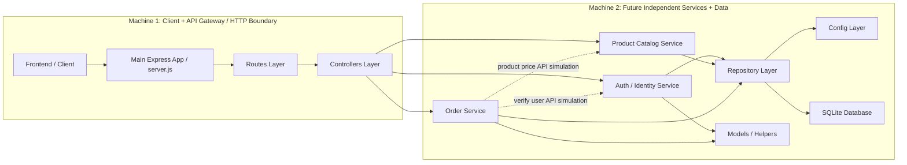

# UML Component Diagram - Microservice Thinking

**Current Modular Monolith and Future Microservice Boundary**

## Components Detected

- Frontend / Client: HTML, CSS, and browser JavaScript pages.
- Main Express App / API Gateway: `server.js`.
- Routes: `routes/auth.js`, `routes/routes.js`, `routes/checkout.js`.
- Controllers: `authController.js`, `productController.js`, `orderController.js`.
- Services: `userService.js`, `productService.js`, `orderService.js`.
- Repositories: `userRepository.js`, `productRepository.js`, `orderRepository.js`.
- Models: `userModel.js`, `orderModel.js`.
- Middlewares: `authMiddleware.js`, `errorHandler.js`.
- Config: `config/auth.js`, `config/database.js`.
- Database / Persistence: SQLite files and relational tables such as Users, Products, Orders, and Order_Items.

## Mermaid Source

## Cut Line

**DOTTED RED CUT LINE: Future Microservice Boundary**

The cut line separates Machine 1, which handles browser delivery and HTTP routing, from Machine 2, which contains business services and persistence. This is a good future split because controllers can become API adapters while Auth, Product Catalog, and Order capabilities can move to independently deployed services.

## Services That Could Become Microservices First

1. Product Catalog Service, because guests can browse products without Auth.
2. Auth / Identity Service, once JWT verification and user lookup are exposed as APIs.
3. Order Service, once it can call Identity and Product Catalog through APIs.

## Future Dependency Changes

- Replace `verifyUserFromUserService()` with an HTTP call to an Identity service.
- Replace `getProductSnapshotFromCatalogService()` with an HTTP call to a Product Catalog service.
- Give each future service its own repository/database ownership.
