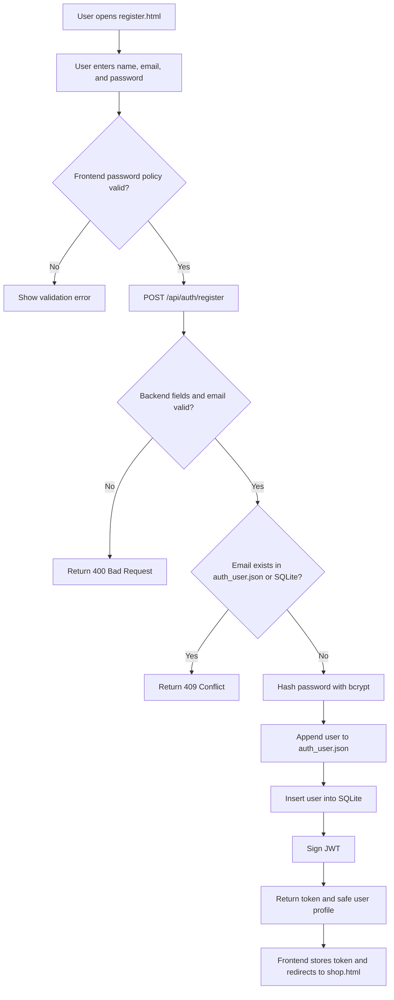
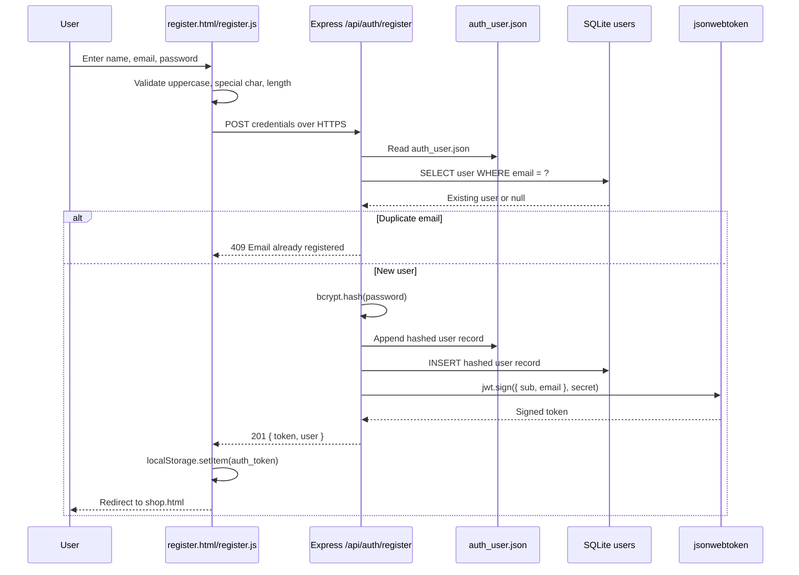

# Register Feature Documentation

## Contract Table

| Field | Contract |
| --- | --- |
| Feature | User registration |
| Endpoint | `POST /api/auth/register` |
| Request Body | `{ "firstName": "Jane", "email": "jane@example.com", "password": "Strong@123" }` |
| Frontend Validation | Name, email, and password are required. Password must be at least 8 characters and include one uppercase letter and one special character. |
| Backend Validation | Validates required fields, email format, password policy, and duplicate email in `auth_user.json` and SQLite. |
| Password Storage | The plaintext password is never stored. The server hashes it with bcrypt before saving. |
| JSON Persistence | New users are appended to `auth_user.json` with a bcrypt password hash and registration date. |
| Database Persistence | New users are inserted into SQLite `users` table with the same bcrypt hash. |
| Success Response | `201 Created` with `{ message, token, user }` |
| Duplicate Email Response | `409 Conflict` with `{ error: "Email is already registered." }` |
| Invalid Input Response | `400 Bad Request` with a validation error message |
| Security Notes | JWT contains non-sensitive identity data. Password comparison uses bcrypt. Errors do not expose whether a password or email was the exact failure point during login. |

## Activity Diagram

## Sequence Diagram

## GenAI Prompt

Act as a Security Engineer and full-stack Node.js developer. Build a user registration feature for an Express and SQLite ecommerce project. Use the following contract:

- Create `POST /api/auth/register`.
- Request body must include `firstName`, `email`, and `password`.
- Validate on the frontend and backend that password is at least 8 characters and includes one uppercase letter and one special character.
- Check duplicate username/email against both `auth_user.json` and the SQLite `users` table.
- Never store plaintext passwords. Use bcrypt to hash the password.
- Append the new registered user to `auth_user.json` with username, bcrypt password hash, firstName, and registrationDate.
- Insert the same user into the SQLite `users` table.
- Sign a JWT after successful registration and return `{ message, token, user }`.
- Create `register.html` and `js/register.js` so the user can register from the browser, store the JWT in `localStorage`, and redirect to `shop.html`.
- Add comments explaining the security logic where useful.
